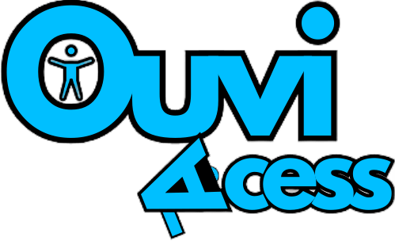

# OuviAcess

<div align="center"></div>

### Instalando e configurando a aplicação
Clone o repositório
```sh
git clone https://github.com/gustavogordoni/OuviAcess_Laravel.git
```


Acesse o diretório
```sh
cd OuviAcess_Laravel/
```


Crie o arquivo .env
```sh
cp .env.example .env
```


Atualize as variáveis de ambiente do arquivo .env 
> Recomenda-se alterar as senhas (passwords)
```dosini
DB_CONNECTION=mysql
DB_HOST=db
DB_PORT=3306
DB_DATABASE=laravel
DB_USERNAME=root
DB_PASSWORD=root

CACHE_DRIVER=redis
QUEUE_CONNECTION=redis
SESSION_DRIVER=redis

REDIS_HOST=redis
REDIS_PASSWORD=null
REDIS_PORT=6379
```


Suba os containers do projeto
```sh
docker-compose up -d
```

Acessar o container
```sh
composer install
```


Instale as dependências do projeto
```sh
composer install
```


Gere a key do projeto Laravel
```sh
php artisan key:generate
```


Acessar o projeto
[http://localhost:8000](http://localhost:8000)
